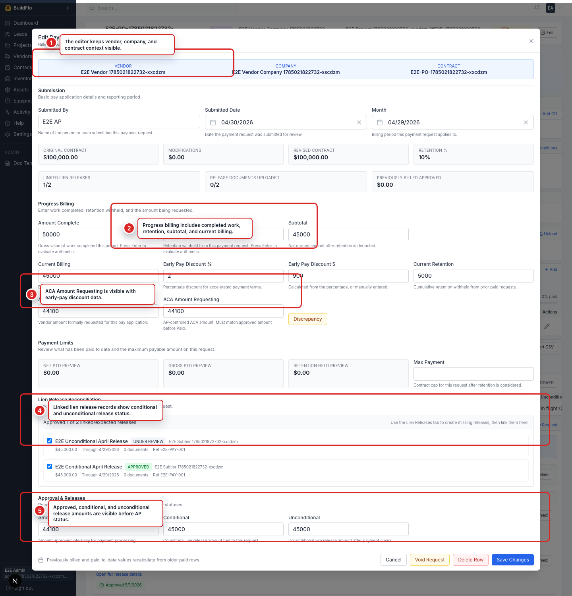
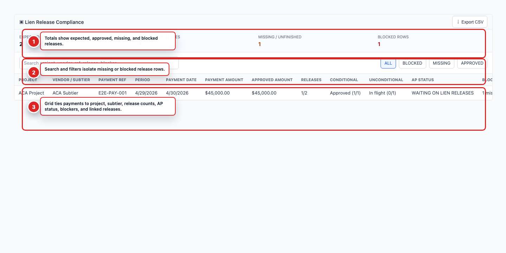
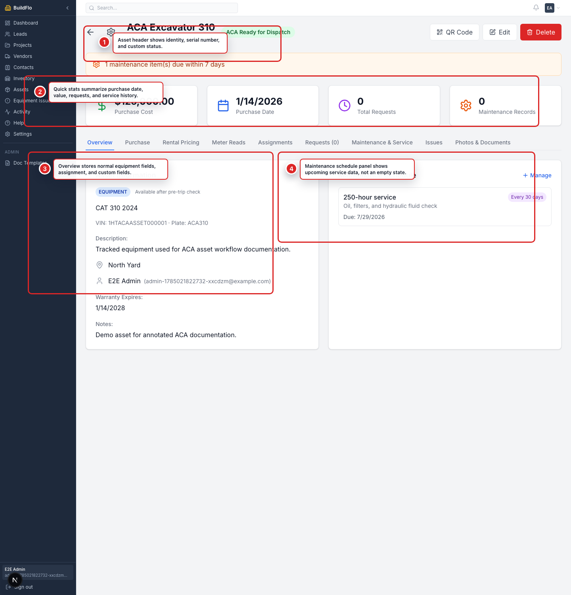
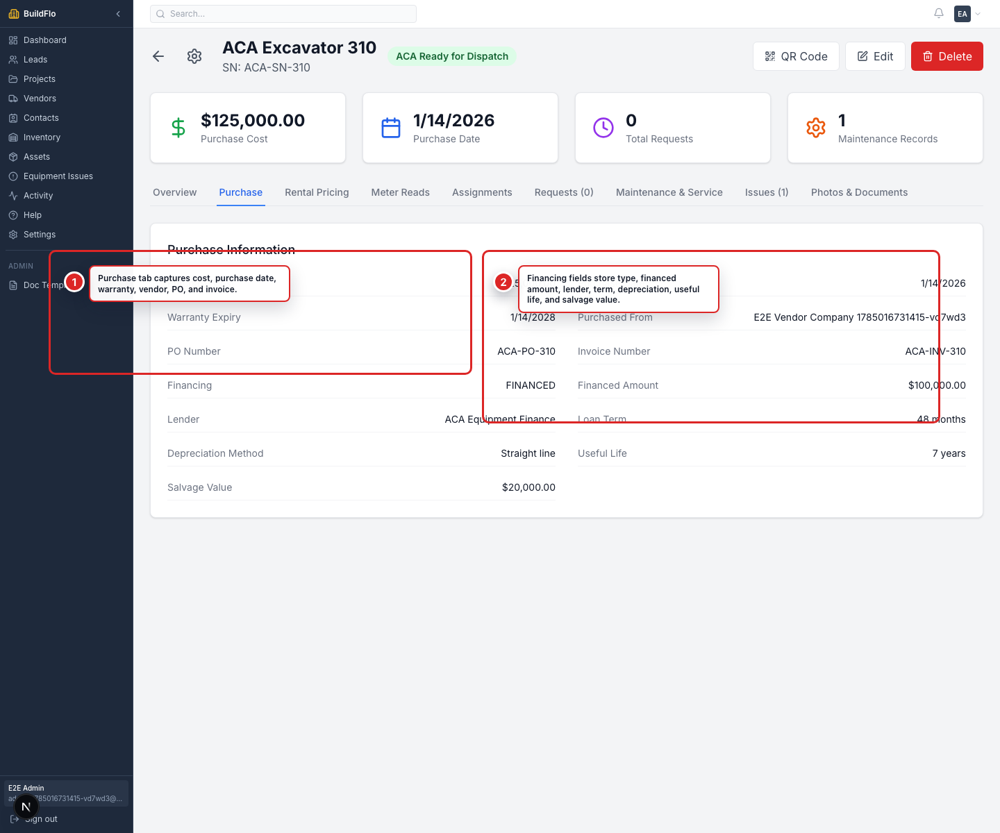
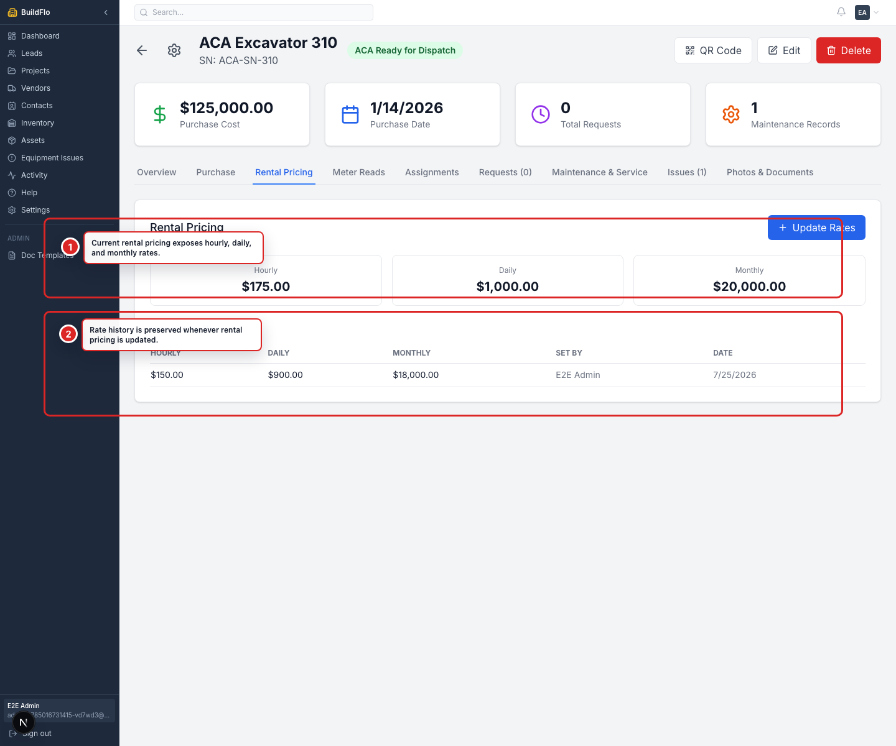
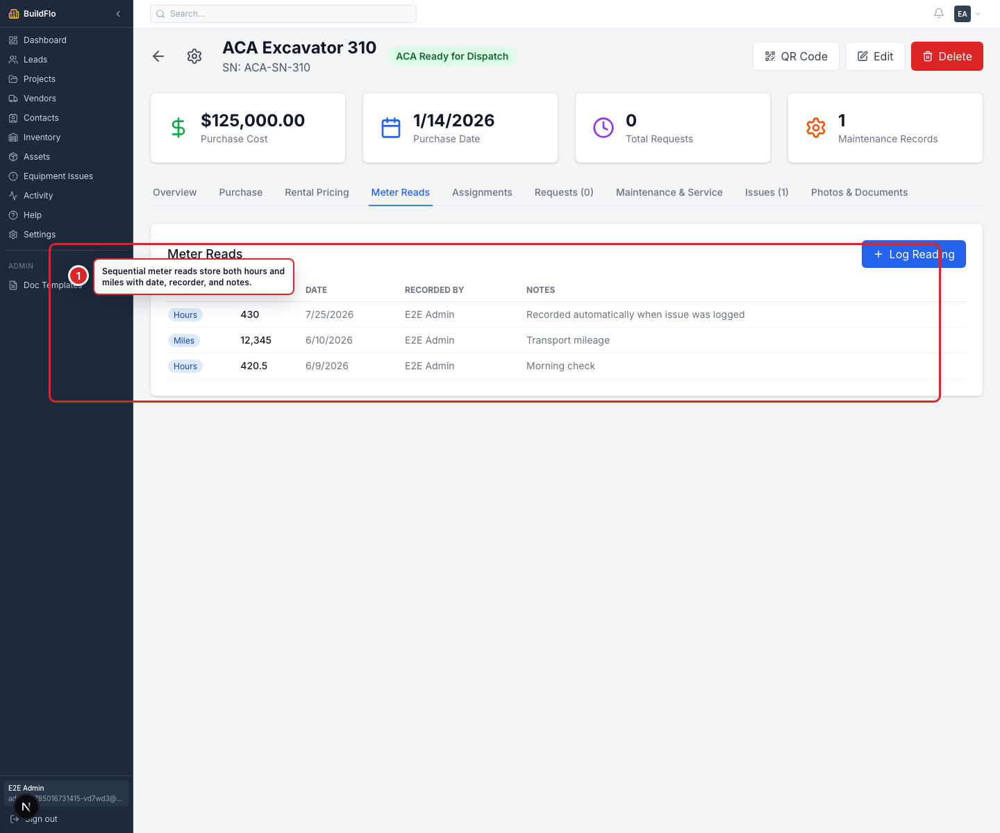
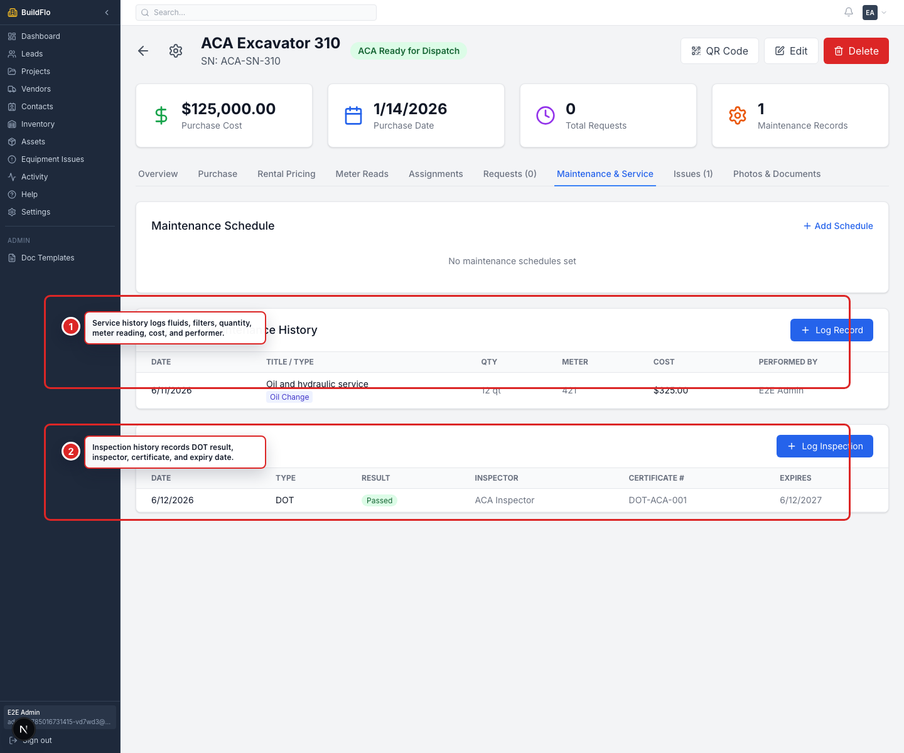
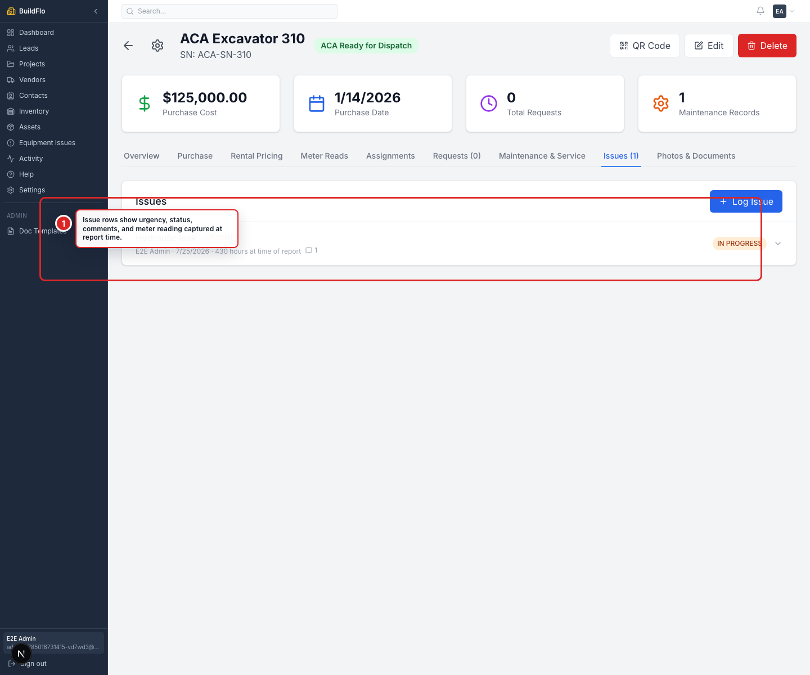
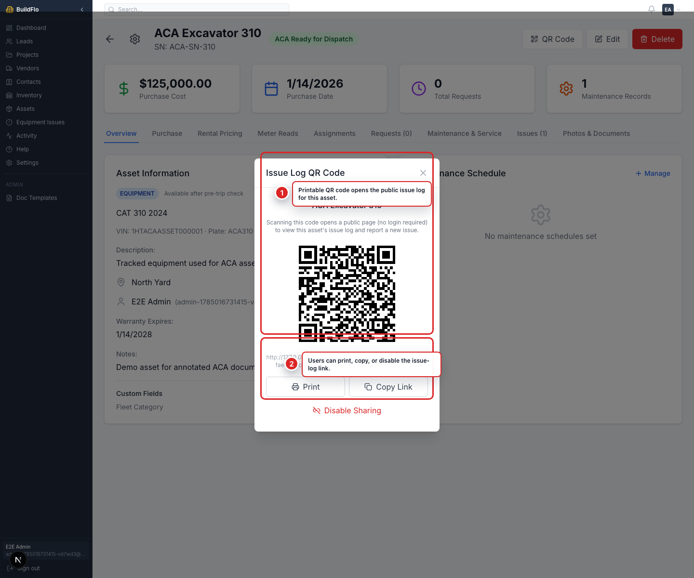

# ACA Feature Documentation

This document is a screenshot-based walkthrough for ACA client review. Each section maps a delivered feature to an annotated UI screenshot and the client requirements it covers.

## Feature 1: Pay App Detail Workflow

### What This Screen Shows

1. **Contract context stays visible**
   The payment editor keeps the vendor, company, and contract number visible while AP reviews or updates a payment row.

2. **Progress billing inputs**
   The form captures work completed, retention withheld, subtotal, and current billing values for the pay application.

3. **ACA amount and discrepancy control**
   AP can maintain the ACA Amount Requesting separately from the vendor requested amount. The Discrepancy action supports flagging differences before the row can move through final AP processing.

4. **Payment limit preview**
   The old paid-to-date preview has been renamed into clearer Net PTD, Gross PTD, and Retention Held preview values.

5. **Lien release reconciliation**
   Payment rows track expected lien releases and provide a reconciliation area for tying actual lien-release records back to the payment workflow.

### Covered Client Requirements

- ACA Amount Requesting field.
- Discrepancy workflow.
- Payment summary cleanup for Net PTD, Gross PTD, and Current Retention Held.
- Lien-release reconciliation area tied to payment rows.
- Detail-level payment actions for save, void, and delete.

### Notes For Review

- Screenshots use Playwright-generated demo data.
- The annotation style is consistent across the ACA feature set.

## Feature 2: Vendor Lien Release Compliance Grid

### What This Screen Shows

1. **Compliance totals**
   The grid summarizes expected, approved, missing, and blocked lien releases for the contract.

2. **Search and status filters**
   Users can isolate missing, blocked, or approved rows and export the current grid to CSV.

3. **Payment-to-release reconciliation**
   Each row ties payment references to project, vendor/subtier, release counts, AP status, blockers, and linked release names.

### Covered Client Requirements

- Vendor Lien Release Spreadsheet equivalent.
- Subtier/supplier flow into lien releases.
- Payment rows show lien-release compliance counts.
- CSV export for spreadsheet-style review.
- Blocker visibility for missing or unfinished releases.

## Feature 3: Asset Overview And Custom Fields

### What This Screen Shows

1. **Asset identity and status**
   The asset header shows equipment name, serial number, type icon, and custom status.

2. **Asset quick stats**
   Summary cards expose purchase value, purchase date, request count, and service-history count.

3. **Normal equipment fields**
   The overview stores make, model, year, VIN, plate, description, location, assigned person, notes, and custom fields.

4. **Maintenance schedule panel**
   The overview gives operators a quick place to see upcoming service reminders.

### Covered Client Requirements

- Normal equipment/vehicle fields.
- Make, model, year.
- Ability to assign equipment or vehicle to a person.
- Custom statuses.
- Custom fields.

## Feature 4: Asset Purchase Tab

### What This Screen Shows

1. **Purchase information**
   The purchase tab stores cost, purchase date, warranty, purchased-from vendor, PO number, and invoice number.

2. **Financing and depreciation**
   The same tab stores financing type, financed amount, lender, loan term, depreciation method, useful life, and salvage value.

### Covered Client Requirements

- Purchase-related tab.
- Relevant purchase data.
- Vendor, PO, invoice, warranty, and financing details.

## Feature 5: Asset Rental Pricing

### What This Screen Shows

1. **Current rental rates**
   The tab displays hourly, daily, and monthly pricing.

2. **Historical pricing**
   Updating rates creates a new row, so previous rental pricing remains visible in history.

### Covered Client Requirements

- Rental pricing tab.
- Hourly, day, and month rental prices.
- Historical pricing visibility after updates.

## Feature 6: Asset Meter Reads

### What This Screen Shows

1. **Sequential meter history**
   The meter log stores hours and miles with value, date, recorder, and notes.

### Covered Client Requirements

- Log meter reads for hours and miles.
- Store sequential meter reads with date.

## Feature 7: Asset Maintenance And DOT Inspections

### What This Screen Shows

1. **Service history**
   Service records capture service type, fluids/filters, quantity, meter reading at service, cost, and performer.

2. **DOT inspections**
   Inspection rows capture DOT status, pass/fail result, inspector, certificate number, and expiration date.

### Covered Client Requirements

- Place to log basic service information.
- Oil, fuel, hydraulic fluids, and filters.
- DOT inspection documentation.

## Feature 8: Asset Issues

### What This Screen Shows

1. **Issue log**
   Issues show urgency, status, comments, reporter, and the meter reading captured when the issue was reported.

### Covered Client Requirements

- Ability to log issues.
- Meter read captured when issue is logged.
- Issue status and urgency.
- Comments for issues.
- Dashboard-style issue status visibility from the asset detail page.

## Feature 9: Asset QR Issue Log

### What This Screen Shows

1. **Printable QR code**
   The modal generates a QR code that opens the public issue log for the asset.

2. **Share controls**
   Users can print the QR code, copy the link, or disable sharing.

### Covered Client Requirements

- Printable QR code.
- QR code takes users straight to the issue log page for that piece of equipment.
